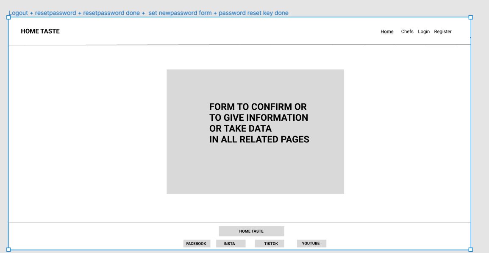
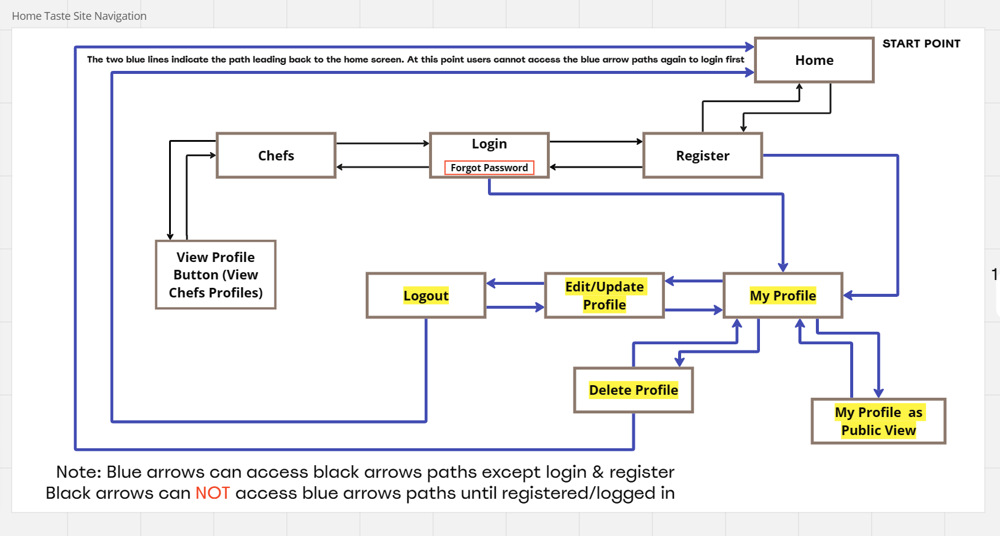

<h1 align="center">👩‍🍳 HOME TASTE 👨‍🍳</h1>
Home Taste is a global culinary hub where home chefs from diverse backgrounds converge to showcase their passion for food. The website facilitates home chef registration and login via the frontend user interface (UI). Upon successful registration and login, home chefs gain access to profile features and can share their culinary schedules, social network profiles, current locations, contact details, specialties, and captivating dish photos. Visitors (general users) can easy to navigate the website and explore chefs based on location (region, country, city), making it simple to find and connect with local talent. Additionally, visitors can share their experiences and feedbacks by leaving comments on chefs’ profiles. Whether you’re seeking to find home chef to order home-cooked meals, planning for events or simply appreciating home culinary artistry, Home Taste invites you to join this flavorful journey.  

###### The website files on Github can be accessed at the following link: [View Project Files on Github](https://github.com/alakeldev/home-taste-pp4)

###### The live website on Heroku platform can be accessed at the following link: [View my Live Website](https://home-taste-2aece88c850a.herokuapp.com/)

## Table of Contents

- [Table of Contents](#table-of-contents)
- [UX](#ux)
  - [Site Purpose](#site-purpose)
  - [Site Goals](#site-goals)
  - [Audience](#audience)
  - [Communication](#communication)
  - [Current User Goals](#current-user-goals)
  - [New User Goals](#new-user-goals)
  - [Future Goals](#future-goals)
- [User-Stories](#user-stories)
  - [Admin Stories](#admin-stories)
  - [Registered Chef Stories](#registered-chef-stories)
  - [General Visitor Stories](#general-visitor-stories)
- [Agile Methodology](#agile-methodology)
- [Design](#design)
  - [Wireframes](#wireframes)
  - [Site Navigation](#site-navigation)
  - [Database Schema](#database-schema)
  - [Colour](#colour)
  - [Typography](#typography)
  - [Imagery](#imagery)
- [Features](#features)
  - [Existing Features](#existing-features)
  - [Features Left to Implement](#features-left-to-implement)
- [Testing](TESTING.md)
- [Technologies Used](#technologies-used)
  - [Main Languages Used](#main-languages-used)
  - [Frameworks, libraries and programs](#frameworks-libraries-and-programs)
- [Deployment](#deployment)
  - [Forking](#forking)
  - [Cloning the repo & Running the project locally](#cloning-the-repo--running-the-project-locally)
  - [Deploying with Heroku](#deploying-with-heroku)
    - [Heroku Settings](#heroku-settings)
    - [Heroku Deployment](#heroku-deployment)
- [Credits](#credits)
- [Acknowledgements](#acknowledgements)

## UX

### Site Purpose

It is website that bridges the gap between passionate home chefs and food enthusiasts. Our mission is to empower home cooks by providing them with a dedicated space to showcase their culinary talents. Chefs can register, create personalized profiles, and share essential information such as contact details, cooking schedules, and captivating images of their signature dishes. Visitors, in turn, have the privilege of exploring comprehensive chef profiles, accessing public information, and leaving valuable feedback through comments.

### Site Goals

- Empowerment: to empower home cooks by providing them with a website to express their creativity, share their love for cooking, and connect with a community of like-minded individuals.
- Visibility: to increase the visibility of home chefs and their unique offerings, allowing them to reach a broader audience.
- Interaction: to foster connection between chefs and visitors, encouraging feedback, culinary discussions, and appreciation.

### Audience

Home Taste caters to two main audiences:

- Home Chefs: Passionate home cooks who want to showcase their skills, build a personal chef profile, and connect with fellow food enthusiasts.
- Food Enthusiasts and Visitors: Individuals who appreciate home-cooked meals, seek culinary inspiration, and enjoy engaging with chefs through comments, social media networks, emails.

### Communication

Our website design ensures clarity, simplicity, and ease of navigation for both home chefs and food enthusiasts.
Here is how we achieve it:

- Clean Layout: Our uncluttered design allows users to focus on what matters most—the culinary talents of our home chefs.
- User-Friendly Experience: Whether you’re an home chef or a visitor food enthusiast, our intuitive layout guides you effortlessly through the platform.
- Clear Pathways: From chef profiles to dish images, we’ve organized everything logically, making exploration a delightful journey.

At Home Taste: communication isn’t just about words—it’s about creating a visual language that speaks to your taste buds.

### Current User Goals

- Showcase Information and Talent: Home chefs aim to display their information, profiles on social networks and culinary expertise, share their passion for cooking, and gain recognition.
- Expand Reach: Home chefs aspire to reach a wider audience beyond their immediate circles.
- Discover New Flavors: Visitors(General Users) explore chef profiles to discover unique cooking styles, regional specialties, and innovative dishes.
- Engage and Appreciate: Visitors(General Users) want to leave comments, express appreciation, and engage in meaningful feedback with chefs.
- Find Local Talent: Visitors(General Users) seek talented home chefs in their vicinity for personalized culinary experiences.

### New User Goals

- New users arrive at Home Taste with curiosity. They want to explore the diverse world of home chefs, discover unique cooking styles, and find hidden home culinary gems behind the chefs.
- Fresh visitors seek interaction. They want to engage with home chefs, leave comments, and express appreciation for mouthwatering dishes.
- Newcomers desire an intuitive experience. They aim to explore chef profiles, understand the platform’s features, and find their way around without any hassle. Whether they’re searching for a specific cuisine or browsing randomly, seamless navigation is key.

### Future Goals

- We envision Home Taste transcending geographical boundaries. Imagine a global culinary community where home chefs from diverse cultures share their flavors, techniques, and stories. From a cozy kitchen in Tokyo to a bustling food market in Marrakech, our platform will connect passionate cooks worldwide.
- We will host virtual cooking workshops. Imagine home chefs leading live sessions, demonstrating their signature dishes, and sharing tips. Participants—both seasoned cooks and beginners—will cook together, ask questions, and learn in real time. It’s a culinary classroom where creativity knows no bounds.
- We will list home chefs delectable dishes, and visitors can place orders directly through our platform. Imagine browsing a chef’s profile, selecting your favorite meal, and having it delivered to your doorstep—all with a few clicks. Secure online payments will make the process hassle-free.
- We will evolve beyond static profiles. Imagine a chat feature akin to WhatsApp, where users can connect with chefs, ask questions about recipes, discuss dietary preferences, and even receive cooking tips. Whether you’re curious about a secret ingredient or want to know the best way to julienne carrots, our chat will be your culinary companion.
- We will provide all users with a seamless and delightful experience. We achieve this by implementing robust alert and success messaging throughout the website(Register, login, logout, comments, chat, online orders, any update on their profile)

## User Stories

Not all stories have been implemented. Some have been left for future implementations as the site grows and expands.

### Admin Stories

- I possess administrative privileges to manage/CRUD operations on user(chef) exist or new  accounts, profiles, and public comments via the admin panel.
- I possess administrative privileges to a list of all registered chefs (Profile/user).
- I possess administrative privileges to a list of all comments (approved/not approved).
- I possess administrative privileges to approve or reject the public comments before they become visible on chefs' profiles.

### Registered Chef Stories

- I have the capability to easy login to my registered account.
- I have the capability to logout of my registered account.
- I have the capability to add, edit, and delete my personal profile data(locations, social media networks links,....).
- I have the capability to add, edit, and delete my cook schedule on my Profile.
- I have the capability to upload/delete my profile picture.
- I have the capability to upload/delete dishes images.
- I have the capability to preview my profile as a public users, allowing me to preview the comments related to my profile and understand how it appears to general users.
- I have the capability to delete my profile along with all the data stored on the website (cannot be undone).
- I have the capability to initiate the password recovery process in the event that I misplace my current account password.
- I have the capability to update the displayed name and email address on my profile page independently of my registration credentials.
- I have the capability to view other chefs' profiles while logged in.
- I have the capability to leave comments on other chefs' profiles or even on my profile too while logged in.

### General Visitor Stories

- I have the capability to register for an account as a chef then i can login after registration.
- I have the capability to easy navigate and understand the structure of the website.
- I have the capability to review profiles of all registered chefs on the website, including their relevant information and associated data.
- I have the capability to preview a specific chef's profile and easy navigate back to all chefs page again.
- I have the capability to leave comments on chefs' profiles.
- I have the capability to search for chefs based on their geographical locations like region, country, and city.

## Agile Methodology

Agile methodology is a flexible and iterative approach to software development that emphasizes collaboration, adaptability, and customer feedback. It allows teams to respond to changing requirements and deliver valuable features incrementally. In this project, we follow Agile principles to enhance productivity and ensure successful project delivery.

- User Stories and Github Issues: I utilized Github issues to create detailed user stories for my project. Each user story included essential components such as story points, acceptance criteria, and associated tasks.These user stories were tracked either on the Kanban board or within the issues themselves.
- Kanban Board for Prioritization: The Github Kanban board played a crucial role in managing my project. User stories were assigned to specific issues, allowing me to define clear goals and priorities. Labels were used to further categorize and prioritize user stories within the Kanban board.

Project Sections: my project was organized into the following sections:

- To-do: User stories awaiting implementation.
- In-progress: Ongoing work.
- Done: Completed tasks.
- Won’t-do: Items were defined as future features.

Sprint Planning with totla (5) Milestones:

- I structured the work into sprints using milestones.
- Each sprint had well-defined objectives.

To review the Kanban board for the project, please click [HERE](https://github.com/users/alakeldev/projects/3)

## Design

### Wireframes

##### Home Page

##### Chefs Page

##### Login Page

##### Register Page

##### My Profile Page

##### Edit Profile Page

##### Chefs Profiles Public View Page

##### (Logout - Reset Password - Reset Password Done - Set New Password Form - Password Reset Key Done) Pages

### Site Navigation

### Database Schema

### Colour

The color scheme has been meticulously curated to enhance the user experience. The chosen colors prioritize cleanliness, reliability, readability, stability, and depth, all while avoiding any overwhelming elements.

### Typography

All fonts used on the website were sourced from the Google Fonts library. I selected the following fonts for different purposes:

1. Oswald: This font is specifically designed for headers and serves as the title font.
2. Arimo: I’ve chosen Arimo as the main font for the website.

### Imagery

The captivating visuals featured on our home page have been thoughtfully curated from [Pexels](https://www.pexels.com/search/home%20chef/),it's a reputable platform for high-quality stock photos, royalty-free images, and videos shared by talented creators.

1. [Landing Image](https://www.pexels.com/photo/a-woman-cooking-on-the-table-8176610/): The revamped landing section image now exudes a sense of tranquility and approachability. The soft color palette and gentle gradients create a soothing ambiance, inviting users to explore further. The central focal point subtly hints at our website’s core purpose, while maintaining a balance that won’t overwhelm visitors. The overlaid text remains legible, ensuring a seamless reading experience.
2. [About Us Image](https://www.pexels.com/photo/sliced-bread-on-brown-wooden-board-349610/): The carefully chosen image in our “About” section serves as a visual embodiment of our website’s core identity. in addition to The color palette of the image harmonizes seamlessly with our overall website color identity.

## Features

### Existing Features

### Features Left to Implement

- Enhance User Trust with Clear and Informative Alert and Success Messages during various interactions on the website.
- Establish User Profiles for Visitors/General Users to Interact with Chef’s Dishes and Implement a Rating System.
- Implement Real-Time Chat Functionality for Seamless Communication Between All Registered Users.
- Create Contact Us Page.
- Develop an Online Ordering and Payment System.
- Implement Social Media Sign-Up/Sign-In Functionality.
- Enable Password Change Functionality Within User Profile Pages.

## Testing

All testing results can be found [HERE](TESTING.md)

## Technologies Used

### Main Languages Used

- HTML5
- CSS3
- Javascript
- Python
- SQL

### Frameworks, libraries and programs

- [VS-Code](https://code.visualstudio.com/) - IDE to write code, create new files and folders for my project before pushing the project to Github.
- [Git](https://git-scm.com/): was used for version control by utilizing the VS-code terminal to commit to Git and push to GitHub.
- [GitHub](https://github.com/): was used to store the projects code after being pushed from Git.
- [Heroku](https://id.heroku.com): was used to deploy my live project.
- [Am I Responsive](http://ami.responsivedesign.is/): was used to create the multi-device mock-up you can see at the start of this README.md file.
- [Favicon.io](https://favicon.io/): was used for making the site favicon.
- [WC3 Validator](https://validator.w3.org/), [Jigsaw W3 Validator](https://jigsaw.w3.org/css-validator/), [JS validator](https://jshint.com/) and [PEP8](https://pep8ci.herokuapp.com/): were all used to validate the website.
- [os](https://docs.python.org/3/library/os.html): python built-in modules.
- [Bootstrap5](https://getbootstrap.com/docs/5.0/getting-started/introduction/): was used to create the front-end design.
- [figma-wireframe-online](https://www.figma.com/templates/wireframe-kits/): was used to create wireframes.
- [Coloors](https://coolors.co/): was used to create the color scheme.
- [Djecrety](https://djecrety.ir/): was used to create a secret key.
- [Cloudinary](https://cloudinary.com/): was used to host the static files and media.
- [Gunicorn](https://gunicorn.org/): as the server for Heroku.
- [Dj_database_url](https://pypi.org/project/dj-database-url/0.5.0/): to parse the database URL from the environment variables in Heroku.
- [Psycopg2](https://pypi.org/project/psycopg2/): as an adaptor for Python and PostgreSQL databases.
- [Allauth](https://allauth.org/): for authentication, registration, account management.
- [Crispy Forms & Crispy Bootstrap5](https://django-crispy-forms.readthedocs.io/en/latest/): to style the forms.
- [djrichtextfield](https://pypi.org/project/django-richtextfield/): for handling rich text content.
- [django resized](https://pypi.org/project/django-resized/): Resizes image origin to specified size and save it in 'WEBP' format.
- [dj-cloudinary-storage](https://pypi.org/project/django-cloudinary-storage/): to facilitates integration with Cloudinary.
- [Django](https://www.djangoproject.com/start/): as a main python framework for my project.
- [Jinja2 - templating language](https://jinja.palletsprojects.com/en/3.1.x/): was used to simplify dynamic content generation, enhance security, and promote code organization in project templates.
- [App.diagram-online](https://app.diagrams.net/): was used to create the database schema.
- [Microsoft Outlook - SMTP settings](https://support.microsoft.com/en-us/office/pop-imap-and-smtp-settings-for-outlook-com-d088b986-291d-42b8-9564-9c414e2aa040): was used to send email to user (scenario: forgot password).
- [Miro-online](https://miro.com/): was used to create the plan of the site navigation.
- [Elephant-sql](https://www.elephantsql.com/): was used to create and access my PostgreSQL databases seamlessly. In addition to write sql commands to get tables and data inside of its SQL browser.

## Deployment

1. A new repository was created using 'Code-Instutute-Org/ci-full-template'.
2. A meaningful name was given to my new repository and I selected 'Create Repository'.
3. inside the created repo select the 'Code' button above the file list on the right hand side.
4. Ensure HTTPS is selected and click the clipboard on the right of the URL to copy it.
5. Open VS-code, creat new project folder, open the terminal, On the terminal type "git clone", then paste the copied url and press 'Enter'.
6. Version control was used throughout the project using the following commands in the terminal:
    - git add . <strong>OR</strong> git add "file name" - to stage the changes and get them ready for being committed to the local repo.
    - git commit -m "Description of the update" - to save the change and commit the change to the local repo
    - git push origin main - to push all committed changes to the GitHub repo.

### Forking

1. Go to [the project repository](https://github.com/alakeldev/home-taste-pp4).
2. In the right most top menu, click the "Fork" button.
3. There will now be a copy of the repository in your own GitHub account.

### Cloning the repo & Running the project locally

1. Go to the following repository on GitHub: <https://github.com/alakeldev/home-taste-pp4>.
2. At the top right of the screen, click the 'Code' button, and then click 'HTTPs'.
3. Copy the link in this field.
4. Open VS-code, creat new project folder, open the terminal.
5. On the terminal type "git clone", then paste the copied url and press 'Enter'.
6. The clone process should now begin.

### Deploying with Heroku

I followed the below steps using the [Code Institute tutorial](https://docs.google.com/document/d/1CncA1F2JClME2S_K0w4XoV3edMjOl_HrOQoEs3h9LOo/edit#heading=h.hvy9tw74f1o0):

The following command in the IDE will create the relevant files needed for Heroku to install your project dependencies `pip3 freeze --local > requirements.txt`.

1. Go to [Heroku.com](https://dashboard.heroku.com/apps) and login, if you do not already have an account then you will need to create one.
2. Click the `New` dropdown and select `Create New App`.
3. Enter a name for your new project, all Heroku apps need to have a unique name, you will be prompted if you need to change it.
4. Select the region you are working in.

#### Heroku Settings  

You will need to set your Environment Variables - this is a key step to ensuring your application is deployed properly.

1. In the Settings tab, click on `Reveal Config Vars` and set the following variables:
    - Add key: `PORT` & value `8000`. This can be delete for final deployment.
    - Add key: DATABASE_URL and the value as your ElephantSQL database URL e.g.
    - Add key: CLOUDINARY_URL and the value as your cloudinary API Environment variable e.g.
    - Add key: SECRET_KEY and the value as a complex string which will be used to provide cryptographic signing.
    - Add `DISABLE_COLLECTSTATIC = 1` if you are still working on the project. This can be delete for final deployment.

2. In your project:
    - Create a file `env.py` and put it into `.gitignore`.
    - Add your settings, like DATABASE_URL, CLOUDINARY_URL and SECRET_KEY to `env.py`.
    - Comment out the original DATABASE settings from `settings.py` and add default Database code.
    - Run your migrations.

#### Heroku Deployment

In the Deploy tab:

1. Connect your Heroku account to your Github Repository following these steps:
    - Click on the `Deploy` tab and choose `Github-Connect to Github`.
    - Enter the GitHub repository name and click on `Search`.
    - Choose the correct repository for your application and click on `Connect`.
2. You can then choose to deploy the project manually or automatically, automatic deployment will generate a new application every time you push a change to Github, whereas manual deployment requires you to push the `Deploy Branch` button whenever you want a change made.
3. Once you have chosen your deployment method and have clicked `Deploy Branch` your application will be built and you should now see the `View` button, click this to open your application.
4. Be sure to delete settings in Heroku like `PORT` and `DISABLE_COLLECTSTATIC`, set `DEBUG` to `False` in your `settings.py` and add `X_FRAME_OPTIONS` there.

## Credits

- [Code-Institute-Curriculum](https://codeinstitute.net/de/) - Full Stack Software Development Curriculum - [I blog 'new content' + Hello Django] Projects.
- [Django-Doc](https://docs.djangoproject.com/en/5.0/) - Was my main source if I stuck in django.
- [Django-CheatSheet](https://github.com/lucrae/django-cheat-sheet) - Cheat sheet on github was a very good and fast source for me.
- [W3Schools-Django](https://www.w3schools.com/django/django_views.php) - Was a very help source of information.
- [Django-Signals](https://docs.djangoproject.com/en/5.0/ref/signals/) - Was used to get more understanding of signals such as post_save, pre_save.
- [Jinja2-Doc](https://jinja.palletsprojects.com/en/3.1.x/) - Was my main source if i stuck with jinja language.
- [Jinja2-Blog](https://ultraconfig.com.au/blog/jinja2-a-crash-course-for-beginners/) - Was a good help source of information.
- [Jinja2-Python-Tutorial](https://www.youtube.com/watch?v=NR-BGPhDICA) - Was a very helpful tutorial to more understand the jinja2 language.
- [Bootstrap5-Doc](https://getbootstrap.com/docs/5.3/getting-started/introduction/) - Was my main guide while building my frontend project.
- [Bootstrap5-CheatSheet](https://bootstrap-cheatsheet.themeselection.com/) - Was fast help full source.
- [CSS-CheatSheet](https://htmlcheatsheet.com/css/) - Was a very help full source to know how target elements and set properties.
- [Udemy-Python-Django](https://www.udemy.com/certificate/UC-aefd5c77-88d7-4a4e-a6f6-d9390bad39ab/) - In April 2022, I attended the Python Mega Course, which helped me to smoothly understand basic Python concepts. Additionally, I was able to learn some advanced material such as Django & Flask.
- [Stackoverflow](https://stackoverflow.com/) - Was used to check and read about any bug and error faced me during my project.
- [DeeMc-Tutorial](https://www.youtube.com/watch?v=sBjbty691eI&list=PLXuTq6OsqZjbCSfiLNb2f1FOs8viArjWy) - I watched the part 1 of this tutorial and it was very helpful source, to set and understand some settings inside my project settings.py.
- [W3Schools-PostgresSQL](https://www.w3schools.com/postgresql/postgresql_create_table.php) - Was my main source to learn SQL statments.
- [Python-Doc](https://docs.python.org/3/tutorial/index.html) - Was a very help source of information.
- [W3Schools-Python](https://www.w3schools.com/python/default.asp) - Was a very help source of information.
- [CI-Slack-Channels](https://code-institute-room.slack.com/) - I relied on the Code-Institute Slack community channels to increase my knowledge and to check for previous problems with the Heroku cloud platform and some errors that other students have faced through PP4.

## Acknowledgements

- I would like to express my gratitude to my mentor 'Martina Terlevic' for her invaluable feedback, advice, tips, and reviewing my project.
