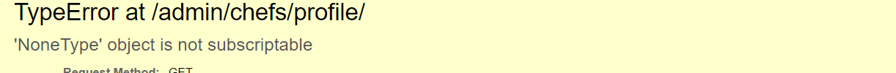

# TESTING

* [Validator Testing](#validator-testing)
* [Responsiveness Testing](#responsiveness-testing)
* [C.R.U.D Testing](#crud-testing)
* [Manual Testing](#manual-testing)
* [Fixed Bugs](#fixed-bugs)
* [Unfixed bugs](#unfixed-bugs)

## Validator Testing

| **TEST** | **ACTION** | **EXPECTATION** | **RESULT** |
| ----------------------------- | ----------------------- | --------------------------- | ---------- |
| manage.py | [PEP8 - CI](https://pep8ci.herokuapp.com/) | [No issues found](static/images/readme/manage-py-file.png) | ✅ |
| home_taste - urls.py | [PEP8 - CI](https://pep8ci.herokuapp.com/) | [No issues found](static/images/readme/home_taste-urls.png) | ✅ |
| home_taste - settings.py | [PEP8 - CI](https://pep8ci.herokuapp.com/) | No issues found | [E501 line too long: AUTH_PASSWORD_VALIDATORS - STATICFILES_STORAGE](static/images/readme/home-taste-settings.png) |
| home app - views.py | [PEP8 - CI](https://pep8ci.herokuapp.com/) | [No issues found](static/images/readme/home-views-file.png) | ✅ |
| home app - urls.py | [PEP8 - CI](https://pep8ci.herokuapp.com/) | [No issues found](static/images/readme/home-urls-file.png) | ✅ |
| chefs app - views.py | [PEP8 - CI](https://pep8ci.herokuapp.com/) | [No issues found](static/images/readme/chefs-views-file.png) | ✅ |
| chefs app - urls.py | [PEP8 - CI](https://pep8ci.herokuapp.com/) | [No issues found](static/images/readme/chefs-urls-file.png) | ✅ |
| chefs app - models.py | [PEP8 - CI](https://pep8ci.herokuapp.com/) | [No issues found](static/images/readme/chefs-models-file.png) | ✅ |
| chefs app - forms.py | [PEP8 - CI](https://pep8ci.herokuapp.com/) | [No issues found](static/images/readme/chefs-forms-file.png) | ✅ |
| chefs app - admin.py | [PEP8 - CI](https://pep8ci.herokuapp.com/) | [No issues found](static/images/readme/chefs-admin-file.png) | ✅ |
| main.js | [JSHint](https://jshint.com/) | [No issues found](static/images/readme/jshint-main-js-file.png) | ✅ |
| base.css | [W3C - Jigsaw CSS](https://jigsaw.w3.org/css-validator/) | [No issues found](static/images/readme/css-w3c.png) | ✅ |
| Home page - html | [W3C - URI](https://validator.w3.org/) | [No issues found](static/images/readme/w3c-home.png) | ✅ |
| Chefs page - html | [W3C - URI](https://validator.w3.org/) | [No issues found](static/images/readme/w3c-chefs.png) | ✅ |
| Chef Information page - html | [W3C - URI](https://validator.w3.org/) | [No issues found](static/images/readme/w3c-chef-information.png) | ✅ |
| Login page - html | [W3C - URI](https://validator.w3.org/) | [No issues found](static/images/readme/w3c-login.png) | ✅ |
| Register page - html | [W3C - URI](https://validator.w3.org/) | [No issues found](static/images/readme/w3c-register.png) | ✅ |
| password/reset page - html | [W3C - URI](https://validator.w3.org/) | [No issues found](static/images/readme/w3c-password-reset-page.png) | ✅ |
| password/reset/done Email sent page - html | [W3C - URI](https://validator.w3.org/) | [No issues found](static/images/readme/w3c-password-reset-done-email-sent.png) | ✅ |
| password/reset/key page opened from the received email - html | [W3C - URI](https://validator.w3.org/) | [No issues found](static/images/readme/w3c-password-reset-key.png) | ✅ |
| password/reset/key/done page password changed - html | [W3C - URI](https://validator.w3.org/) | [No issues found](static/images/readme/w3c-password-key-done.png) | ✅ |
| My Profile page - html | [W3C - Direct Input](https://validator.w3.org/) | [No issues found](static/images/readme/w3c-my_profile-page.png) | ✅ |
| Edit/Update Profile page - html | [W3C - Direct Input](https://validator.w3.org/) | [No issues found](static/images/readme/w3c-edit-profile-page.png) | ✅ |
| Logout page - html | [W3C - Direct Input](https://validator.w3.org/) | [No issues found](static/images/readme/w3c-logout-page.png) | ✅ |
| Delete profile page - html | [W3C - Direct Input](https://validator.w3.org/) | [No issues found](static/images/readme/w3c-delete-profile-page.png) | ✅ |
| Home page - html | lighthouse | [Acceptable scores](static/images/readme/light-house-overall.png) | ✅ |
| MS-Edge browser | Launch site | Site opens without issue | ✅ |
| Chrome browser | Launch site | Site opens without issue | ✅ |
| Safari browser | Launch site | Site opens without issue | ✅ |

## Responsiveness Testing

| **TEST**                      | **ACTION**              | **EXPECTATION**             | **RESULT** |
| ----------------------------- | ----------------------- | --------------------------- | ---------- |
| Home page - responsiveness    | Size site down to 320px | all elements stay on screen | ✅         |
| Home page - responsiveness    | Size site up to 1920px  | all elements stay on screen | ✅         |
| Chefs page - responsiveness   | Size site down to 320px | all elements stay on screen | ✅         |
| Chefs page - responsiveness   | Size site up to 1920px  | all elements stay on screen | ✅         |
| Chef-Info Profile page - responsiveness  | Size site down to 320px | all elements stay on screen | ✅         |
| Chef-Info Profile page - responsiveness  | Size site up to 1920px  | all elements stay on screen | ✅         |
| Login page - responsiveness    | Size site down to 320px | all elements stay on screen | ✅         |
| Login page - responsiveness    | Size site up to 1920px  | all elements stay on screen | ✅         |
| Register page - responsiveness | Size site down to 320px | all elements stay on screen | ✅         |
| Register page - responsiveness | Size site up to 1920px  | all elements stay on screen | ✅         |
| My Profile page - responsiveness | Size site down to 320px | all elements stay on screen | ✅         |
| My Profile page - responsiveness | Size site up to 1920px  | all elements stay on screen | ✅         |
| Update Profile page - responsiveness | Size site down to 320px | all elements stay on screen | ✅         |
| Update Profile page - responsiveness | Size site up to 1920px  | all elements stay on screen | ✅         |
| Logout page - responsiveness | Size site down to 320px | all elements stay on screen | ✅         |
| Logout page - responsiveness | Size site up to 1920px  | all elements stay on screen | ✅         |
| Delete Profile page - responsiveness | Size site down to 320px | all elements stay on screen | ✅         |
| Delete Profile page - responsiveness | Size site up to 1920px  | all elements stay on screen | ✅         |
| Forgot Password process (4-pages) - responsiveness | Size site down to 320px | all elements stay on screen | ✅         |
| Forgot Password process (4-pages) - responsiveness | Size site up to 1920px  | all elements stay on screen | ✅         |

## C.R.U.D Testing

| **TEST**          | **ACTION**             | **EXPECTATION**          | **RESULT** |
| ----------------- | ---------------------- | ------------------------ | ---------- |
| Profile - Create     | Add new instance to DB | Instance created         | ✅         |
| Profile - Read       | Retrieve all instances and data | Instances and data visible in UI  | ✅         |
| Profile - Update     | Modify an instance     | Mods saved & visible     | ✅         |
| Profile - Delete     | Delete an instance     | Instance removed from UI with all its data and other instances that have relation with it (Comments) | ✅         |
| Comments - Create | Add new instance to DB | Instance created         | ✅         |
| Comments - Read   | Retrieve all instances | Instances visible in UI  | ✅         |

## Manual Testing

| **TEST**                      | **ACTION**             | **EXPECTATION**                                           | **RESULT** |
| ----------------------------- | ---------------------- | --------------------------------------------------------- | ---------- |
| Home Page: Verify that the “Home Page” loads correctly   | Open the website  | The user can see all elements without any delay  | ✅ |
| Home Taste (Name as Logo): Verify that the “Home Taste” logo displays clearly |  Open the website | The user can see the website name displayed clearly as the “Home Taste” logo | ✅ |
| Nav bar: Ensure that clicking on navigation links works correctly  |  Click on the navigation links in the navigation bar  | The user is correctly routed to the corresponding page       | ✅ |
| Nav bar: Ensure that the navigation bar elements appear in the middle along with the burger icon (responsive-pad/mobile) | Check the navigation bar on different screen sizes  | The user should see the navigation elements centered, accompanied by the burger icon | ✅|
| Nav bar(not registered users): Confirm that non-registered users can access appropriate pages | Observe the navigation bar when not logged in | The navigation bar should display only links relevant to non-registered or logged-out users  | ✅ |
| Register button (landing section): Verify that clicking the “Register” button functions correctly | Click on the “Register” button | The user should be routed to the correct page  | ✅   |
| Collapsing Flush Accordion (About Section): Confirm that users can interact with the accordion sections  | Click on the accordion sections   | Users can read the data within each section, and when one section is open, the others should close properly |     ✅     |
| Meet Our Chefs Button (Inside the Third Accordion Element): Ensure that clicking the “Meet Our Chefs” button works as expected | Click on the “Meet Our Chefs” button  | The user should be routed to the correct page  |✅      |
| Footer Social Media Networks Icons: Verify that clicking on the footer icons opens the corresponding social media websites in a new browser tab   | Click on the social media icons in the footer  | The user should be routed to the respective social media websites in a new tab  | ✅ |
| Chefs Page: Open the Chefs page (either via the navigation bar or the “Meet Our Chefs” button)   | Navigate to the Chefs page   | The user can see all elements on the page clearly and without any delay  | ✅         |
| Search Bar on Chefs Page: Confirm that users can search for chefs based on location     | Enter a chef’s location in the search bar and click the search button | Users should see all chefs related to the entered location (region, country, or city). If no matches are found, a clear sentence should display along with a link to load all chefs again  | ✅      |
| Chefs Cards on Chefs Page: Verify that chefs’ cards are displayed for all registered chefs  | Navigate to the Chefs page | The user can see chefs’ cards along with their data for all registered chefs in a very clear and informative way  | ✅    |
| Chefs Cards Default Image and Info: Confirm that chefs’ cards display a default profile picture and info if not set by the chef  | Observe the chefs’ cards | Users should see a default image indicating that the chef has not set a profile picture, along with the “(not set)” phrase for other card data  | ✅   |
| View Profile Button (Inside Chefs Cards): Ensure that clicking the “View Profile” button works as expected   |  Click on the “View Profile” button within a chef’s card | The user should be routed to the appropriate chef profile information page | ✅     |
| Chefs Profile Information Page: Verify that clicking the “View Profile” button on a specific chef’s card loads the profile information page properly and without any delay | Click on the “View Profile” button for a chosen chef  | The profile information page should display the chef’s information, profile image, dishes images, and comments related to the chosen chef  | ✅  |
| 'Back to Chefs Cards' Button (On Chef Profile Information Page): Confirm that clicking the “Back to Chefs Cards” button leads the user back to the chefs page (chefs cards) |  Click on the “Back to Chefs Cards” button  | The user should be routed back to the chefs page, where they can choose another chef to view their profile information page | ✅  |
| Default Values on Chefs Profile Information Page: Ensure that users see default images and information if not set by the user | Observe the profile information page | The default images and information should be displayed properly and in the correct place | ✅  |
| Chefs Social Media Icons: Verify that clicking on a chef’s display social media icons opens the respective social media profile in a new window | Click on the social media icons associated with a chef | The social media profile should open in a new browser window | ✅  |
| Instruction/Schedules Area: Confirm that users can scroll to read information if it’s long  | Observe the instruction/schedules area   | A scroll should appear if the information is lengthy or extends beyond the visible area | ✅  |
| Displayed Comments Area Inside Chef Profile Information Page: Scroll down the page and observe the displayed comment section  |  Scroll through the comments area  | If the chef has no comments, only the subject(Comments) should appear. If the chef has comments, the comments section should extend to display approved comments related to that chef   | ✅  |
| Displayed Comments Area Scroll: Verify that users can scroll down the displayed comments area to read all comments related to a specific chef | Scroll through the comments section    | Users should be able to check all comments related to that chef | ✅  |
|A Comment Form Inside Chef Profile Information Page: Confirm that users can submit comments on the chef page  |  Locate the comment form   |  The form should have clear input fields, allowing users to easily submit comments related to the chef’s profile information page | ✅  |
| Comment Form (Name Field): Ensure that users can fill in the name field  | Enter a name in the name field  |  (The field should accept only letters) - (The maximum length for the name should be 20 characters) - (Users should not be able to enter numbers, symbols, or leave it empty)  | ✅ |
| Comment Form (Email Field): Ensure that users can fill in the email field  | Enter an email address in the email field  | (The field should accept only valid email addresses) - (The maximum length for the email should be 50 characters) - (Users should not be able to enter data that is different from a valid email address) | ✅  |
| Comment Form (Comment Field): Confirm that users can fill in the comment field   | Enter a comment in the comment field  | (The field should accept letters, numbers, and symbols) - (The maximum length for the comment should be 200 characters) - (There should be a minimum requirement (least 10 letters) to accept the comment)  | ✅  |
| Comments Form Error Messages Below Inputs   | Fill the comments form with incorrect data (no name, numeric name, comment without words) |  Users should see error messages below the input fields explaining why the comments submission failed  | ✅  |
| Form Alert Message: Verify that an alert message appears after submitting the comment form  | Submit a comment using the form  | The alert message should clearly indicate whether the comment was accepted or not | ✅  |
| Login Page: Click on the Login link (Nav or Register page) to go to the login page    | Navigate to the login page | The login page and form should load clearly, displaying all related labels, inputs, and buttons | ✅  |
| Register Link on Top of Login Form: Register Word Displayed  | Click on the “Register” word link | The link on the word “register” should work properly and lead to the register form | ✅  |
| Login Process: User fills in the inputs with a username/email and password to log in  | Attempt to log in | (If the user is registered, successful login occurs) - (If the user is not registered, an error message should appear indicating that the specified username and password are incorrect)  | ✅  |
| Login Successful: User fills in the credentials with registered information and logs in  | Log in with valid credentials | (A success message should appear along with the user’s name) - (The user should be redirected to their profile page) | ✅  |
| Forgot Password Link (Login Page): User forgets their password and clicks on the “Forgot Password” link  | Click on the link | The forgot password process should be initiated, and the user should be redirected to a password reset form where they can enter their email address. An email will be sent to allow password reset  | ✅  |
| Reset Password Email: User enters and fills in the email field in the reset password form  | Submit the form | (If the email is registered, the sent email should include the user’s name along with a secure link to set a new password for the account) - (If the email is not registered, an email should be sent notifying the user that the email is not registered with our website, along with a link to the signup page to encourage them to register) | ✅  |
| Company Email (Forgot Password Process): User is concerned about not receiving the reset password email and finding the process difficult  |  Display the link to the company email along with the forgot password process/pages | The user will click on the email link, which will redirect them to their email application with the company email address pre-filled in the “To:” field | ✅  |
| Register Page: User navigates to the Register page through the navigation bar or by clicking the link on the sign-in page  | Navigate to the Register page | The Register page and form should load properly, allowing the user to fill in all required data | ✅  |
| Register Page (Sign-In Link): Registered user navigates to the register page by mistake (instead of clicking the login link) | Observe the register form | The sign-in link should appear at the top of the register form, leading to the sign-in form | ✅  |
| Register Form: User fills in the register form fields and registers on the website  | Fill in the required fields   | The user should be able to fill in the fields with the necessary data to allow and accept registration | ✅  |
| Register Form (Email Field): User enters their email to register  | Enter an email address in the email field  | The email field should be entered as Email form/type - The email should not be a registered email (unique and related to only one user) | ✅  |
| Register Form (Username Field): User enters their username to register  | Enter a username in the username field  | (The username field should accept letters, numbers, and some special characters ) - (The username should not be a registered username that related to a registered user) - (The username should be unique and related to only one user, also connecting with their public view information profile URI. ) | ✅  |
| Register Form (Username Field) Error Message: User enters special characters or white space in the username field |  Enter special characters or white space in the username field | An error message should appear, indicating which characters are allowed for use in the username | ✅  |
| Register Form (Password Field & Password Again Field): User fills in the password and password again to register for an account  | Enter passwords in both fields   | (The password and password again fields should hide the value displaying *) - (Full information should be displayed between these two fields to prevent errors related to password similarity) - (The passwords entered in both fields must match; otherwise, an error should be raised) | ✅ |
| Register Form (Important Note): User wants to take care of the username and email because they are fixed and will be related to the profile until deletion  | Observe the register form | A note should appear above the signup button, notifying the user about the importance of the email address and username | ✅  |
| Registration Success   |   Fill in the required details during registration    | Registration successful, user redirected to profile page        | ✅  |
| Register Success Alert as Signed In    | Registered successfully | An alert message should indicate sign-in and display the user’s name along with with the mesasage     | ✅  |
| My Profile Page: Verify Correct Loading    | Ensure the “My Profile Page” loads correctly    | Profile page elements loaded as expected | ✅  |
| My Profile Page elements and data  | Check the my profile page     | The profile page should display default values and images | ✅  |
| Nav Bar for Logged-In Users    | Observe the navigation bar after logging in/ registering       | New pages visible in the navigation bar      | ✅  |
| Update Button on My Profile Page: Validate the presence of the update button on the profile page     | Examine my profile page    |  Update button present       | ✅  |
| Delete Button on My Profile Page: Validate the presence of the “Delete” button on the profile page     | Observe the profile page   | The “Delete” button should be visible, allowing users to delete their profile.  | ✅  |
| View as Public Button on My Profile Page  | Observe the my profile page     | The “View as Public” button should be visible | ✅|
| View as Public Functionality   | clicks the “View as Public” button     | The chef’s public profile should display, allowing information and comments related to the profile to be checked | ✅  |
| Back to My Profile Button (After Viewing as Public)    | Observe the page after viewing as public.  | The button should be visible, allowing the user to return to their own profile.   | ✅  |
| Back to My Profile Button Functionality     | Chef clicks the “Back to My Profile” button  | The user should be redirected to their profile page   | ✅  |
| Social Media Icons on My Profile Page     | Ensure that social media icons appear if chef set its own account and function correctly     | Social media icons should be visible and clickable, leading to the chef’s social accounts in new tabs| ✅  |
| Delete Button Functionality | User clicks the “Delete” button     | it should display a confirmation page, warning that deletion is irreversible | ✅  |
| Confirm Delete Page - Cancel Button    | User clicks the “Cancel” button     | The user should be redirected back to their profile page | ✅  |
| Confirm Delete Page - Delete Button    |  User clicks the “Delete” button     |  The user should be redirected to the home page, and an alert message should confirm successful profile deletion | ✅  |
| Login After Account Deletion    | User attempts to log in after confirming deletion    | An alert message should indicate that the username and password are incorrect (similar to any other user without an account) | ✅  |
| Logout Button  in the navigation bar (Logged-In User)   | User clicks the logout button  | The user should be taken to the logout confirmation page | ✅  |
| Logout Confirm Page - Cancel Button   |  User clicks the “Cancel” logout button    |  The user should be directly redirected to their personal profile page | ✅  |
| Logout Confirm Page - Logout Button   | User clicks the “Logout” button     | The user should be redirected to the home page, and an alert message should confirm successful sign-out | ✅  |
| Update Profile Button on My Profile Page    | User clicks the “Update Profile” button     | The user should be directed to the update profile page | ✅  |
| Nav Bar - Edit Profile Link   | User clicks the “Edit Profile” link    | The user should be taken to the edit profile page (similar to clicking the “Update Profile” button on my profile page) | ✅  |
| Form edit Profile load seccessfully  | uesr navigate to edit its profile   | the edit/update profile page/form loaded properly | ✅  |
|  Valid Name Entry   | Enter a valid name (containing only letters, white spaces between letters) in the input field  | The input should accept the valid name without any errors. | ✅  |
| Invalid Name Entry (Special Characters) | Enter a name containing special characters (e.g., numbers, symbols) in the input field.    | An error message should appear, indicating that the name should contain only letters. | ✅  |
| Empty Name Field   |  Leave the name field empty.     |  An error message should appear, prompting the user to enter a name | ✅  |
|  Valid Email Entry   |  Enter a valid email address (e.g., <user@example.com>) in the input field    | The input should accept the valid email address without any errors | ✅  |
| Invalid Email Entry (Incorrect Format)     | Enter an invalid email address (e.g., invalid_email) in the input field     |An hint/notify message should appear, indicating that the email format is incorrect | ✅  |
| Empty Email Field    | Leave the email field empty     | The input should allow an empty value (since it’s marked as blank=True and null=True) | ✅  |
| Different Email from Registration  | Enter an email address different from the one used during registration     | The input should accept the different email address without any issues | ✅  |
|  Valid Image Upload (profile picture and dishes images)   | Upload an image file (e.g., a valid profile picture) in the input field     | The input should accept the image without any errors | ✅  |
| Invalid Image Format     | Upload a file that is not in the specified format (e.g., a non-WEBP, jpg.. image).     | An error message should appear, indicating that the image format is incorrect | ✅  |
| Empty Image Field     | Leave the image field empty    | The input should allow an empty value (since it’s marked as blank=True and null=True) | ✅  |
| Large Image Size    |  Upload an image larger than the specified dimensions (e.g., more than 400 pixels wide for profile pciture and 600 pixels for dishes images)     | The input should handle large images gracefully (e.g., resize) | ✅  |
|  Valid Phone Number Entry    | Enter a valid phone number (e.g., “+1 123-456-7890” or “1234567890”) in the input field   | The input should accept the valid phone number without any errors | ✅  |
|  Invalid Phone Number (Insufficient Digits)   | Enter a phone number with fewer than 6 digits (e.g., “12345”)     | An error message should appear | ✅  |
|  Invalid Phone Number (Invalid Characters)   | a phone number containing invalid characters    | An error message should appear, specifying that the phone number should consist of digits and symbols (-, +, ()) | ✅  |
| Empty Phone Number Field        | Leave the phone number field empty     |  The input should allow an empty value | ✅  |
| Valid Cuisine Entry     | Enter one or two valid cuisines (e.g., “Indian” or “Italian”) in the input field     | The input should accept the valid cuisine names without any errors | ✅  |
| Invalid Cuisine Entry (Insufficient Characters)    | Enter a cuisine name with fewer than 3 characters      | An error message should appear must be include letters and symbols | ✅  |
| Invalid Cuisine Entry (Invalid Characters)   | Enter a cuisine name containing invalid characters (e.g., “It@lian”)  | An error message should appear, specifying that the cuisine should consist of letters and symbols (, - /) | ✅  |
| Empty Cuisine Field      | Leave the cuisine field empty   | The input should allow an empty value | ✅  |
|  Valid Region Selection       | Choose a valid region from the available options (e.g., “Asia” or “North America”)   | The selection should be accepted without any errors | ✅  |
|  Default Region Value   | Load the form without making any specific region selection  | The default region (“Europe”) should be preselected | ✅  |
| Valid Country Entry    | Enter a country name     |  should accept the country name less  than 12 char without any errors | ✅  |
|  Long Country Name (Abbreviation)   | if it has long country name, use its abbreviation  | The input should accept the full name if it's short and its abbreviation if it's long | ✅  |
|Empty Country Field  |  Leave the country field empty    | The input should allow an empty value | ✅  |
| Invalid Country Entry (Special Characters)  | Enter a country name containing special characters   |  An error message should appear, indicating that the country name should contain only letters | ✅  |
|    Valid City Entry   | Enter a valid city name    | The input should accept city name less than 12 char without any errors | ✅  |
| Invalid City Entry    |  Enter a city name containing special characters   | An error message should appear, indicating that the city name should contain only letters | ✅  |
| Empty City Field    | Leave the city field empty     | The input should allow an empty value (since it’s marked as blank=True and null=True) | ✅  |
| Long City Name (Abbreviation)    | use city abbreviation    | The input should accept the name if it's short and its abbreviation if it's long. | ✅  |
| Valid Instructions Entry     | Enter valid cook instructions or schedules within the specified character limit (up to 6000 characters) *****please read the unfixed bugs section  | The input should accept the valid instructions without any errors | ✅  |
|  Instructions Exceeding Maximum Length     | Enter instructions longer than the specified maximum length (e.g., more than 6000 characters) *****please read the unfixed bugs section   |  An error message should appear, indicating that the instructions exceed the allowed limit | ✅  |
| Empty Instructions Field       | Leave the instructions field empty    | The input should allow an empty value | ✅  |
| Valid Facebook URL     |  Enter a valid Facebook URL     |  The input should accept the valid Facebook URL without any errors | ✅  |
| Invalid Facebook URL     |  Enter an invalid Facebook URL - try another social media company x or any other URL  |An error message should appear, indicating that the Facebook URL is invalid | ✅  |
| Valid Instagram URL   | Enter a valid Instagram URL  | The input should accept the valid Instagram URL without any errors | ✅  |
| Invalid Instagram URL    | Enter an invalid Instagram URL - try another social media company x or any other URL     |  An error message should appear, indicating that the Instagram URL is invalid | ✅  |
| Valid Youtube URL     |  Enter a valid Youtube URL   | The input should accept the valid Youtube URL without any errors | ✅  |
| Invalid Youtube URL        | Enter an invalid Youtube URL - try another social media company x or any other URL   |An error message should appear, indicating that the Youtube URL is invalid | ✅  |
| Valid Tiktok URL     | Enter a valid Tiktok URL  | The input should accept the valid Tiktok URL without any errors | ✅  |
| Invalid Tiktok URL     | Enter an invalid Tiktok URL - try another social media company x or any other URL     | An error message should appear, indicating that the Tiktok URL is invalid | ✅  |
| All social media URL links     | User leave all social media url fields empty     | no errors will display and it will accept it as a value and it has a default display value notify the general user that chef didn't specify any social media links | ✅  |
| save changes     | user entering valid values to one input or more  | The updated data has been successfully saved and is now displayed on my profile page, accompanied by an alert message confirming that my profile has been updated | ✅  |
| save changes     | user entering one or more invalid values    | When an error occurs during profile updates, an alert message will be displayed at the top of the update profile page. Additionally, a pop-up will appear below the relevant field, providing the exact reason for the failed save. | ✅  |

## Fixed Bugs

During the development lifecycle of this project, I encountered several critical bugs and challenges. My approach was methodical and thorough, aiming to deliver robust solutions. Here are some of the key issues I addressed:

* Database Schema Refinement:
  * One significant bug pertained to the database schema, specifically the phone field that need to install a package and add it to the project settings.py . Initially, it was implemented as complex data type, but after careful consideration, I decided to simplify it by changing it to a char field and set some validation on it.

* View Rendering Issues:
  * Another set of challenges arose when working with views. Despite creating the necessary views, I encountered difficulties displaying data correctly within the templates. Debugging involved meticulous examination of the view logic, template rendering, and data flow.

* URL Handling Mistake:
  * I had initially defined project URLs but inadvertently misused them within the templates. Correcting this required careful inspection of URL patterns, ensuring proper linkage between views and templates.

* Update Profile Form Issue:
  * I encountered an error related to the “update profile” form. Accidentally calling a form inside the Crispy form triggered an issue. To resolve this, I reviewed my form structure, ensured proper nesting, and adjusted the form rendering. The error message indicating that a form cannot be called inside another form was addressed, resulting in a smooth user experience.

* Below some images related to some of the fixed bugs I encountered during the development process:
    - 1
     
    - 2
    
    - 3
    
    - 4
    
    - 5
    
    - 6
    
    - 7
    
    - 8
    
    - 9
    
    - 10
    

## Unfixed Bugs

* During the development of this project, I encountered an unresolved bug related to the RichTextField (also known as djrichtextfield). This issue manifests when a large amount of text is rapidly copied and pasted into the RichTextField. Upon attempting to save the form, an error occurs. While the local version displays the error as shown in the photo below, the live version results in a 500 error.

#### Bug Details

- Field: RichTextField (djrichtextfield).
- Symptoms: Error during form submission.
- Cause: Large text input.
- Local Error (Screenshot): as per the image above.

In my pursuit to resolve the RichTextField issue, I embarked on an extensive exploration of potential solutions. I read some articles, delved into the intricacies of the RichTextField, and experimented with adjusting the field’s maximum length. While successfully limiting the input to 100 or 200 characters using max_length, I encountered an unexpected behavior. When I increased the limit to 5000 characters and entered a larg text, it triggered the error in question.
